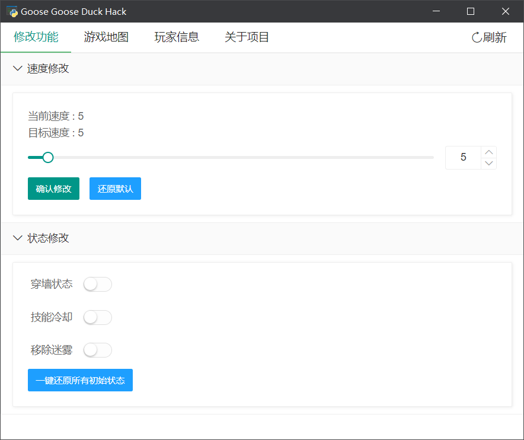
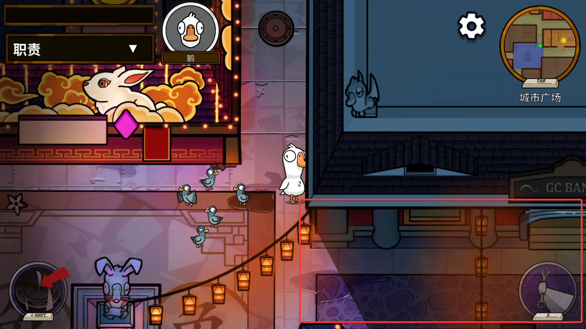
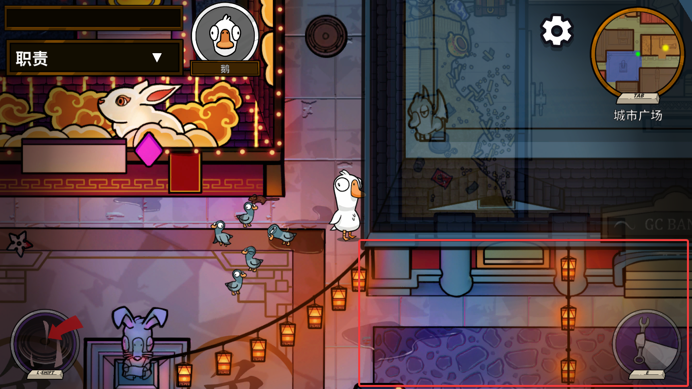
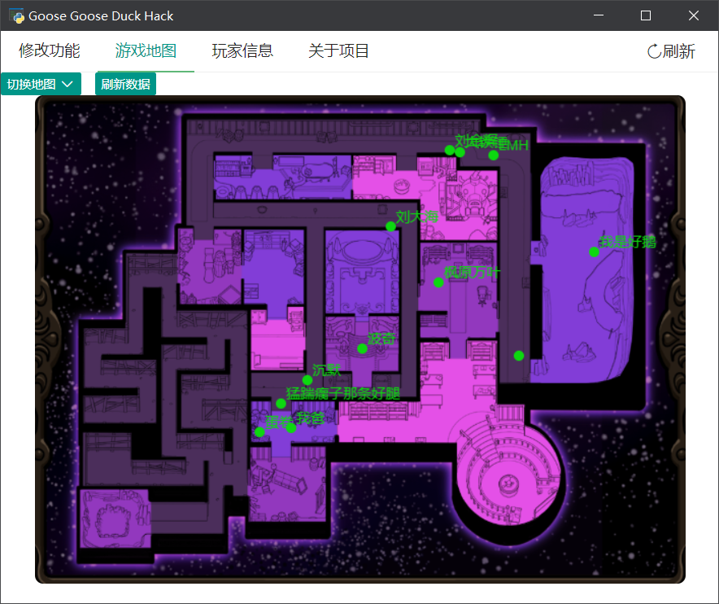
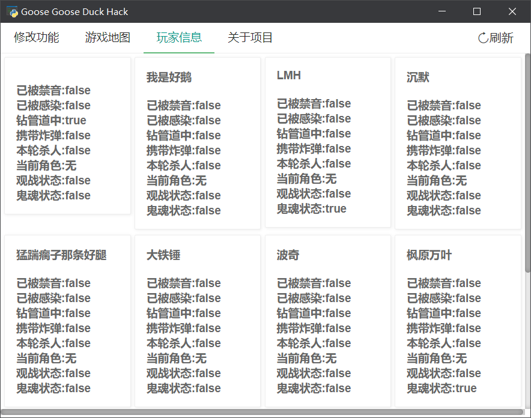

<h1 align="center">Welcome to Goose_Goose_Duck_Hack_Py 🐋</h1>
<p>
</p>


> 一个使用Python编写的Goose Goose Duck Cheat。
>
> 内存操作使用[pymem](https://github.com/srounet/Pymem)，GUI界面使用[pywebview](https://github.com/r0x0r/pywebview)。

## Before All
由于游戏的大更新外加鄙人学术不精，本项目归档~

本项目**仅用来学习**，若对本项目进行滥用，作者本人不会对此负责！

在此感谢[Liuhaixv](https://github.com/Liuhaixv)的项目[Liuhaixv's Goose_Goose_Duck_Hack](https://github.com/Liuhaixv/Goose_Goose_Duck_Hack/)，本项目是基于该项目的c++代码编写的Python版本。

## TODO
- 版本大更新了，很多功能失效，有时间会修复！
- 已经更新最新的offsets，但是穿墙可能存在问题
- 编写自动完成任务的hook
- 添加快捷键

## Use Directly

下载最新发行版本，双击Goose_Goose_Duck_Hack_Py.exe运行GUI程序。

或者使用命令行cmd进行命令行输入，例如`Goose_Goose_Duck_Hack_Py.exe --help`

如果你不想控制台输出各种错误信息，请使用`Goose_Goose_Duck_Hack_Py.exe --log=False`的方式在cmd或powershell启动！

若不想使用打包好的发行版本也可以使用下面的方式进行安装并在本地运行👇

## Install

```sh
pip3 install -m requirements.txt
```

## Usage

使用如下命令默认开启GUI模式

```sh
python3 main.py
```

**修改功能**

- 移速修改
- 穿墙修改
- cd修改
- 迷雾修改








**游戏地图**

- 选择地图
- 玩家位置
- 左键地图进行传送




**玩家信息**

- 查看玩家部分状态




若不想启用GUI，也可以使用**命令模式**进行修改，使用如下代码查看更多帮助信息。命令功能使用[click](https://github.com/pallets/click)完成。

```sh
python3 main.py --help
```

```sh
Usage: main.py [OPTIONS]

Options:
  --gui BOOLEAN       Whether to open GUI window
  --windows INTEGER   Number of GUI windows
  --log BOOLEAN       Need to view log information
  --speed FLOAT       Hack the player's current movement speed
  --wall BOOLEAN      Hack the player's cross the wall status
  --fog BOOLEAN       Hack the player's the fog of war
  --cd BOOLEAN        Hack the player's cooling state
  --showinfo INTEGER  Display information of the target player
  --help              Show this message and exit.
```
## Q&A

**Q: 找不到游戏进程**

A: 请确保游戏开启并使用管理员权限执行Python命令

**Q: 地图首次渲染失败**

A: 点击地图界面的刷新数据或者点击右上角的刷新


*更多出现的BUG或者建议可以提在issue中！*

## Author

 **woodwhale**

* Website: https://www.woodwhale.top/
* Github: [@Awoodwhale](https://github.com/Awoodwhale)

## Show your support

Give a ⭐️ if this project helped you!

## Reference

[Liuhaixv's Goose_Goose_Duck_Hack](https://github.com/Liuhaixv/Goose_Goose_Duck_Hack/)
